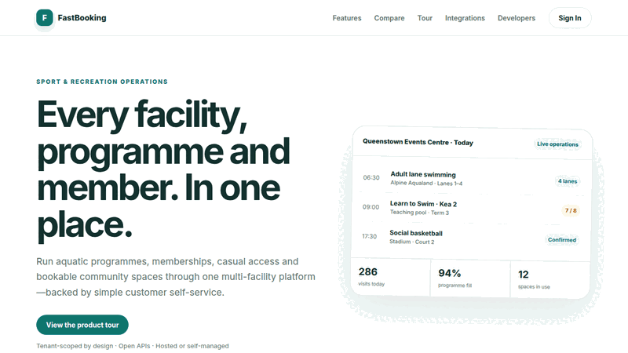

# FastBooking

FastBooking is a multi-tenant recreation, booking, and commerce platform for
sport and aquatic facilities, restaurants, hotels, private clinics, and
ticketed events. Tenant administrators enable only the product modules they use.

## Product walkthrough



## Product modules

- **Sport and recreation:** swimming lessons and other programmes, aquatic lane
  allocation, gym and fitness memberships, casual visits and check-in,
  attendance, stadium/court/room booking, hosted checkout, and financial
  reporting.
- **Restaurants:** menus, carts, pickup orders, reservation-linked dine-in
  pre-orders, tables, party capacity, and table reservations.
- **Hotels:** room-type inventory, per-night pricing, and half-open stay ranges.
- **Private clinics:** public scheduling backed by FastClinic-owned
  practitioners, availability, and appointments. FastBooking stores no clinical
  records.
- **Events:** scheduled concerts or events, ticket types, sale windows,
  capacity, and per-booking limits.

All modules share tenants, locations, customer profiles, booking references,
allocations, notifications, usage records, a payment ledger, and secure
management tokens. New accounts require an administrator-assigned workspace.
Recreation operations can be paired through open APIs with
sister products such as FastCRM for wider customer relationship workflows,
FastERP for finance, FastInsights for analytics, and FastMail for team email.

## Architecture

The production monolith mounts FastAPI at `/api` and FastHTML at `/`. PostgreSQL
is the source of truth. Inventory changes use database row locks to prevent
double-booking. Alembic owns schema upgrades.

Key paths:

```text
app/db/platform_models.py   tenant, booking, inventory, and SaaS models
app/services/booking.py     module-specific allocation strategies
app/api/routers/platform.py tenant configuration and public API v1
app/ui/pages/platform.py    public site, customer journeys, Google SSO, RBAC dashboard
alembic/                    database migrations
seed.py                     representative five-module demo tenant
```

## Local development

Requirements are Python 3.11+, `uv`, and PostgreSQL.

```bash
uv venv
uv pip install --python .venv/bin/python -e ".[dev]"
cp .env.example .env
.venv/bin/alembic upgrade head
.venv/bin/python -m seed
.venv/bin/python -m app.main_monolith
```

Open `http://localhost:5023`. Useful checks:

```bash
.venv/bin/ruff check app tests alembic seed.py
.venv/bin/pytest -q
docker build -t fastbooking:dev .
```

Every public navigation item has a dedicated route: `/features`, `/industries`,
`/tour`, `/integrations`, `/partners`, `/compare`, and `/developers`. Industry
pages provide deeper workflows for sport and recreation, aquatics and swim
schools, restaurants, hotels, clinics, and events. `/sitemap.xml`, `/robots.txt`,
and `/llms.txt` expose the complete public discovery surface.

Tenant booking pages use `/book/{tenant_slug}` and provide dedicated restaurant,
hotel, event, facility, and clinic journeys. The API catalogue is
`/api/v1/public/{tenant_slug}/catalogue`; interactive API documentation is
available under `/api/docs`.

## Image credits

Customer journey photography is stored locally for reliable delivery and is
used under the Unsplash License:

- Restaurant — [Adrien Olichon](https://unsplash.com/photos/h2_8LFfjUUc)
- Hotel — [Alex Muzenhardt](https://unsplash.com/photos/4MQ0T4zBIys)
- Clinic — [Vitaly Gariev](https://unsplash.com/photos/7-l5EL7YHI4)
- Events — [kofa boyah](https://unsplash.com/photos/St-6SCwofGo)
- Facilities — [CHUTTERSNAP](https://unsplash.com/photos/4X1cKO7t3s8)
- Aquatics — [Yanping Ma](https://unsplash.com/photos/QIZFFoGzuaI)

## Configuration and deployment

Copy variable names from `.env.example`; never commit values. Production
requires `DATABASE_URL`, `SESSION_SECRET`, Google OAuth credentials, Postmark,
and a dedicated FastBooking-to-FastClinic connector token. Stripe is optional:
when configured, FastBooking creates hosted Checkout sessions and records signed
webhook outcomes; otherwise recreation purchases remain payable at the facility.

The root `Dockerfile` listens on `0.0.0.0:5023`, runs migrations before startup,
and exposes `/healthz` and `/readyz`. FastDevOps declares the Coolify service at
`https://booking.fastsme.com`; `scripts/coolify.py` delegates validation,
environment synchronization, and deployment to that control plane.
