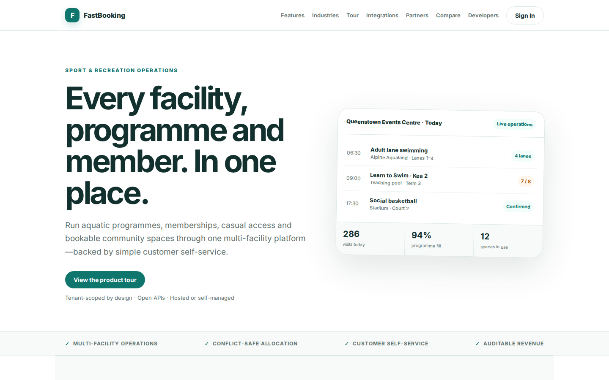
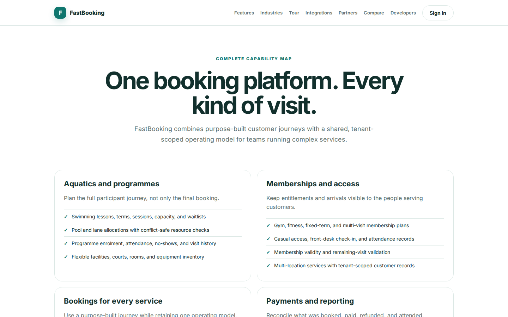
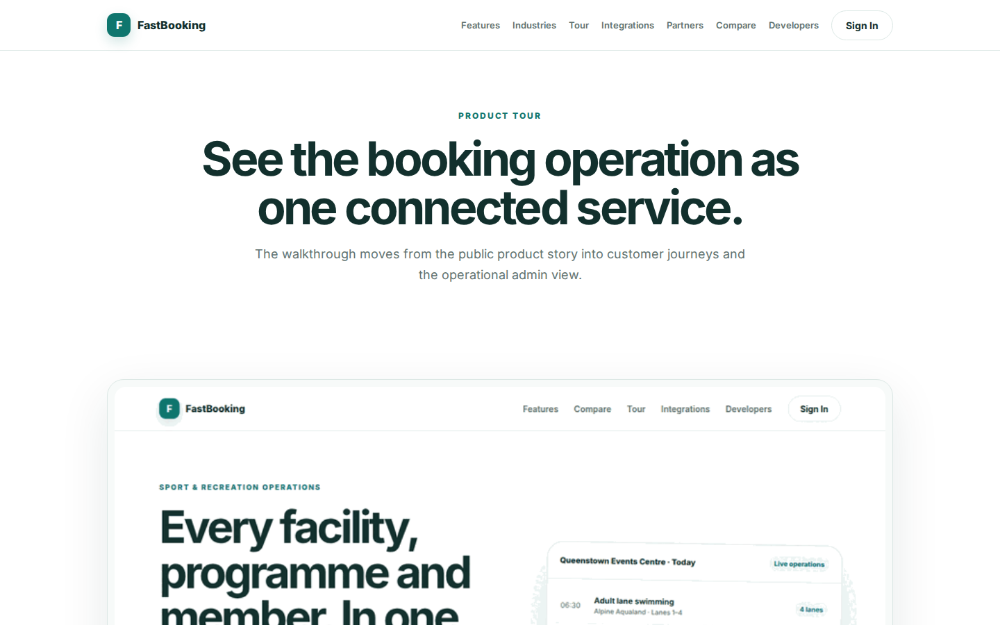

# FastBooking Platform Guide

**Published:** 2026-08-19
**Platform:** [https://booking.fastsme.com](https://booking.fastsme.com)
**Source:** [github.com/predictivelabsai/FastBooking](https://github.com/predictivelabsai/FastBooking)

## Platform overview

FastBooking is a multi-tenant recreation, booking, and commerce platform for sport and aquatic facilities, restaurants, hotels, private clinics, and ticketed events. Tenant administrators enable only the product modules they use.

This visual guide was reviewed against the live product using Playwright. Screens and available navigation can vary by account, role, and deployment configuration.

## 1. Every facility, programme and member. In one place.

SPORT & RECREATION OPERATIONS Every facility, programme and member. In one place. Run aquatic programmes, memberships, casual access and bookable community spaces through one multi-facility platform—backed by simple customer self-service. View the product tour

Screen reviewed at: [https://booking.fastsme.com/](https://booking.fastsme.com/)

## 2. One booking platform. Every kind of visit.

COMPLETE CAPABILITY MAP One booking platform. Every kind of visit. FastBooking combines purpose-built customer journeys with a shared, tenant-scoped operating model for teams running complex services. Aquatics and programmes Plan the full participant journey,

Screen reviewed at: [https://booking.fastsme.com/features](https://booking.fastsme.com/features)

## 3. Sign in

Sign in with Google Sign in to continue to fastsme.com Email or phone Forgot email? Next Create account Afrikaans azərbaycan bosanski català Čeština Cymraeg Dansk Deutsch eesti English (United Kingdom) English (United States) Español (España) Español (Latinoam

Screen reviewed at: [https://accounts.google.com/v3/signin/identifier?opparams=%253F&dsh=S520395662%3A1787122632805850&access_type=online&client_id=887059023987-2a7spj1m82eivobdbt1itb3cqca6tpt1.apps.googleusercontent.com&o2v=2&prompt=select_account&redirect_uri=https%3A%2F%2Fbooking.fastsme.com%2Fauth%2Fgoogle%2Fcallback&response_type=code&scope=openid+email+profile&service=lso&state=GLsv4MzA3lhuT_cZrGZjV5XZUH4BR3azYVor3T-tTBU&flowName=GeneralOAuthLite&continue=https%3A%2F%2Faccounts.google.com%2Fsignin%2Foauth%2Flegacy%2Fconsent%3Fauthuser%3Dunknown%26part%3DAJi8hAOYHbyDn9YY02zJvCRxhMXzXADSfZERaafXHJqSCp2OpvWGzg7N8JiqnfFw78_CHocWTODloNt1sxcKmNpiGhyPy__qPROYQKDGKIcZojU2x5d5czyYV8aD4IMwDO0TenebBdXph_tOYSR0daeR7PF98u6F3lv38gP4eLqNEyZRa1mgc9csQxBZZfWXmBNliwXo9dKuig5s6LIoegOn7VDDk_LAJNGUJGenSicXna9Go_7zbMUw-_kSjtzuRcT_y7EKRtCy_yoaMBVVy2lsRoNqhZ9vP9fCZQP8vOOIRblhV5S9aJS2dTqA8qSD2GB_oBSCyZH93BWX2xWHe537EFtsJavwvCGV7pVQj6XKOrrpWqt6GgKVXGRutDrfCObCfNwuhwQ0Iwe6Bc21lzb7W7iicfdME2jbEqIUjd4NojUUHmbOOv1px-zxlZlGdv66fUOEk9ac2J95L6IX2t9WhNrCDwJIhw%26flowName%3DGeneralOAuthFlow%26as%3DS520395662%253A1787122632805850%26client_id%3D887059023987-2a7spj1m82eivobdbt1itb3cqca6tpt1.apps.googleusercontent.com%23&app_domain=https%3A%2F%2Fbooking.fastsme.com&rart=ANgoxcfqxJKmCC426PeZx-VkeYbkhrcpobgqzEmJ_bDxW1PH4YJLQwPg2a1yUp5kCKEULLii4gTLMwk2TBKLbkeC8IYY-bled1rzIb7ZI-Pp52fV0UG_B_o](https://accounts.google.com/v3/signin/identifier?opparams=%253F&dsh=S520395662%3A1787122632805850&access_type=online&client_id=887059023987-2a7spj1m82eivobdbt1itb3cqca6tpt1.apps.googleusercontent.com&o2v=2&prompt=select_account&redirect_uri=https%3A%2F%2Fbooking.fastsme.com%2Fauth%2Fgoogle%2Fcallback&response_type=code&scope=openid+email+profile&service=lso&state=GLsv4MzA3lhuT_cZrGZjV5XZUH4BR3azYVor3T-tTBU&flowName=GeneralOAuthLite&continue=https%3A%2F%2Faccounts.google.com%2Fsignin%2Foauth%2Flegacy%2Fconsent%3Fauthuser%3Dunknown%26part%3DAJi8hAOYHbyDn9YY02zJvCRxhMXzXADSfZERaafXHJqSCp2OpvWGzg7N8JiqnfFw78_CHocWTODloNt1sxcKmNpiGhyPy__qPROYQKDGKIcZojU2x5d5czyYV8aD4IMwDO0TenebBdXph_tOYSR0daeR7PF98u6F3lv38gP4eLqNEyZRa1mgc9csQxBZZfWXmBNliwXo9dKuig5s6LIoegOn7VDDk_LAJNGUJGenSicXna9Go_7zbMUw-_kSjtzuRcT_y7EKRtCy_yoaMBVVy2lsRoNqhZ9vP9fCZQP8vOOIRblhV5S9aJS2dTqA8qSD2GB_oBSCyZH93BWX2xWHe537EFtsJavwvCGV7pVQj6XKOrrpWqt6GgKVXGRutDrfCObCfNwuhwQ0Iwe6Bc21lzb7W7iicfdME2jbEqIUjd4NojUUHmbOOv1px-zxlZlGdv66fUOEk9ac2J95L6IX2t9WhNrCDwJIhw%26flowName%3DGeneralOAuthFlow%26as%3DS520395662%253A1787122632805850%26client_id%3D887059023987-2a7spj1m82eivobdbt1itb3cqca6tpt1.apps.googleusercontent.com%23&app_domain=https%3A%2F%2Fbooking.fastsme.com&rart=ANgoxcfqxJKmCC426PeZx-VkeYbkhrcpobgqzEmJ_bDxW1PH4YJLQwPg2a1yUp5kCKEULLii4gTLMwk2TBKLbkeC8IYY-bled1rzIb7ZI-Pp52fV0UG_B_o)

## 4. See the booking operation as one connected service.

PRODUCT TOUR See the booking operation as one connected service. The walkthrough moves from the public product story into customer journeys and the operational admin view. FastBooking platform walkthrough 01 Live operations See bookings, programmes, visits and

Screen reviewed at: [https://booking.fastsme.com/tour](https://booking.fastsme.com/tour)

## Getting started

Visit [https://booking.fastsme.com](https://booking.fastsme.com) to explore FastBooking. For source code and deployment details, use the GitHub link above.
